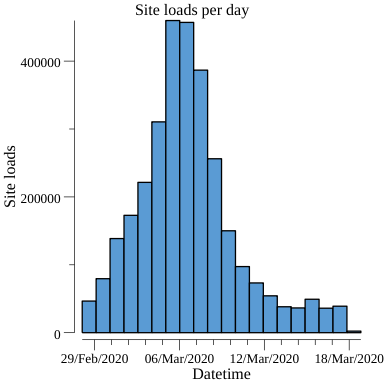

# Nginx log plotter

## Reasoning
Every now and then I need to plot Nginx logs from certain time span.
Using Prometheus or Kibana would be overkill as the server is barely maintained.
And anyway I wanted to learn gonum so this was an good excuse.

## Installation
Clone the repo and do `go build`.

## Usage
`./nginx-lograph /dir/where/my/extracted/nginx/logs/are`

### Screencapture

## Caveat
* Doesn't work with gzipped files, at least yet.

* Is rough.
